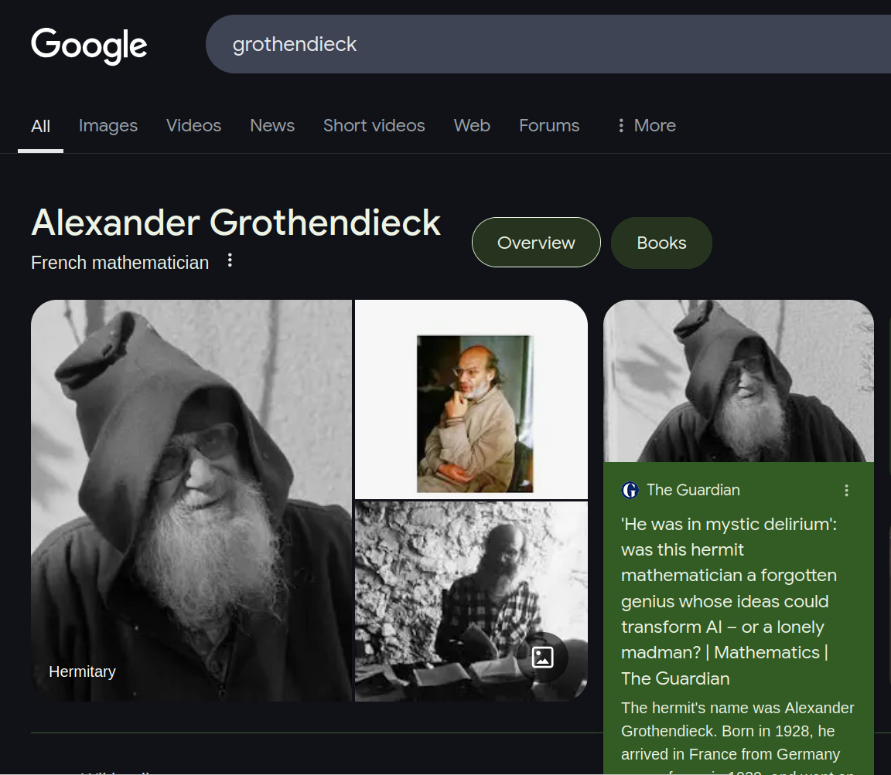
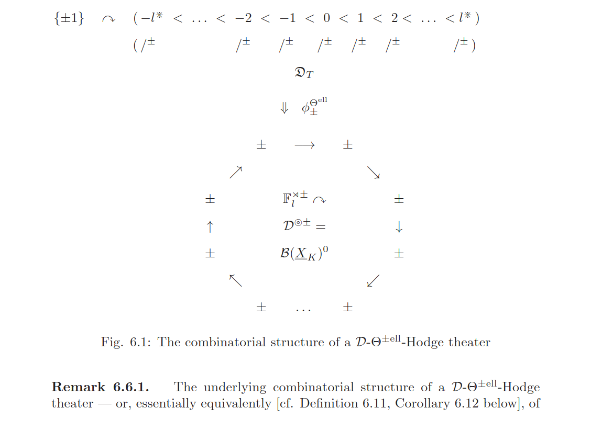
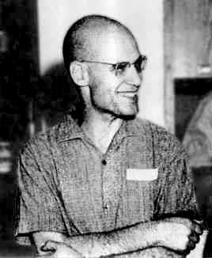

---
title:
- A formalization of Borel determinacy in Lean
author:
- Paweł Balawender
date:
- March 19, 2025
# pandoc -t beamer prezentacja.md -o prezentacja.pdf --bibliography references.bib --citeproc  -M link-citations=true -V colortheme:crane -V theme:CambridgeUS --csl apa.csl
# pdftk A=inria-curryhoward.pdf B=prezentacja.pdf cat B1-7 A8-15 output out.pdf
---

# Choice of proof assistant
>- Suppose you have just proved a theorem and would like to formalize it
>- In which system should you do it? In Rocq? In Isabelle? Maybe Mizar?
>- Good criteria: user experience, existing standard libraries, etc.
>- But the proof assistant is only as strong as the logic it uses internally!

# The power of different provers
>- Crucial criterion: if you took the logic of a specific prover, could you prove your theorem in this logic?
>- If your theorem prover is based on intuitionistic logic, you might not prove a classical theorem
>- Specifically: in Lean, you will not prove that for every predicate $P$, $P \lor \not P$ holds.
>- (Lean is expressive enough to understand the second-order sentence $\forall P, P \lor \not P$ and take is as an axiom, so you can use it without proving)
>- Beware: these logics are not simple!

# Let's consider a game
>- Consider the set of all infinite sequences of natural numbers, $\mathbb{N}^\mathbb{N}$, and a subset $A \subseteq \mathbb{N}^\mathbb{N}$, which we call the winning set.
>- Alice and Bob alternately pick natural numbers $n_0, n_1, n_2, ...$. Alice is the first one to pick.
>- That generates a sequence $\langle n_i \rangle_{i \in \mathbb{N}}$. Alice wins iff the generated sequence belongs to $A$, the set of winning sequences.

# When Alice can win?
>- If the winning set is finite, then the set of elements $B_1$ that Bob should choose in his first turn is also finite. So Bob can choose any number from $\mathbb{N} - B_1$ and the rest of the game doesn't matter - Alice loses.
>- In this proof, we need to be able to:
>- Define natural numbers $\mathbb{N}$
>- Define an infinite, ordered sequence of numbers
>- Define a set of sequences, the winning set
>- Define taking the second element of a sequence
>- Define a set $B_1$ of second elements
>- Prove that $\mathbb{N} - B_1$ is not empty
>- Prove that for any suffix, Bob's sequence won't be winning

# ZFC: Zermelo-Fraenkel axioms of set theory + choice (1922)
>- Here, i will have 9 slides with the concrete definitions, but will only talk about the definition if someone actually asks about it
>- Extensionality
>- Regularity
>- Specification
>- Pairing
>- Union
>- Replacement (*)
>- Infinity
>- Power set
>- Choice
>- Relate these axioms to the proof above to convince reader that the existence of the proof above is actually not that obvious as it seems

# {N, P(N), P(P(N)), ...}
>- This set is not definable in ZF without the axiom schema of replacement!
>- Will we not run into troubles while proving statements about more complicted winning sets in our game?

# Gale-Stewart
>- A Gale-Stewart game is a pair $G = (T, P)$, where T is a nonempty pruned tree and $P \subseteq [T]$ is the winning set. Define topology, open, closed and Borel sets of sequences; open, closed and Borel games.

# Is the game determined when the winning set is open or closed?
>- todo: a proof, needs transfinite induction?

# Is the game determined when the winning set is Borel?
>- This is much more difficult!
>- Harvey Friedman showed that determinacy for Gale-Stewart games where the winning set is only Borel, is not provable in ZF without the axiom schema of replacement!
>- But will we be able to prove it in Lean 4?

# ZFC version used in Lean 4

# Modeling ZFC in Coq
>- There are a few projects, but no uniform way to work with ZFC in Coq
>- I honestly don't know the details. You define that a ZFC-set is a Type, then define some properties. It is very very subtle
>- In the HoTT book, there is a whole section on ZFC. Requires in-depth HoTT knowledge, so also category theory and algebraic topology.

# Theory of Mizar: Tarski-Grothendieck set theory
>- ZFC + Tarski's axiom, which implies existence of inaccessible cardinals
>- enough to define category theory, in contrast to ZFC
>- Mizar: a Polish theorem prover. In 2009 its mathlib was the biggest body of formalized maths in the world!
>- the underlying theory of Mizar is precisely first-order logic with Tarski-Grothendieck set theory
>- if you were to formalize that ALL games are determined, Mizar would certainly not be your best assistant: determinacy of all games implies Axiom of Determinacy, which is known to contradict the Axiom of Choice.

# Alexander Grothendieck (1928-2014)

>- algebraic geometry
>- synthesis between geoalg and number theory
>- synthesis between geoalg and topology
>- Grothendieck universes
>- introduced topoi to category theory
>- worked with Teichmuller, whose idea I showed in my last presentation; Grothendieck-Teichmuller group

# Throwback: How can you expect tax-payers to believe in this? (Inter-universal Teichmüller theory)

# Grothendieck, 1970

# Grothendieck, Lasserre, France, 2013

<!-- # References {.allowframebreaks} -->

